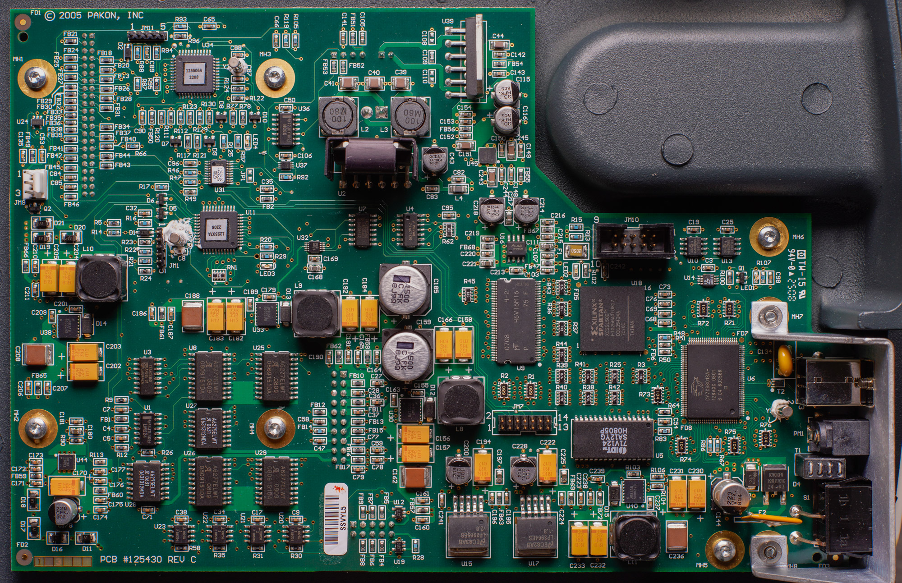
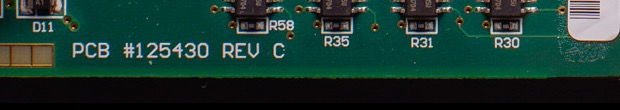
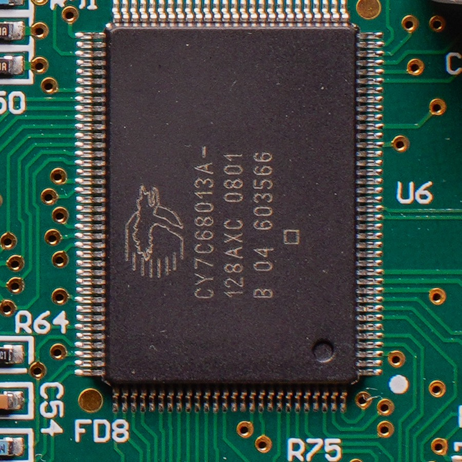
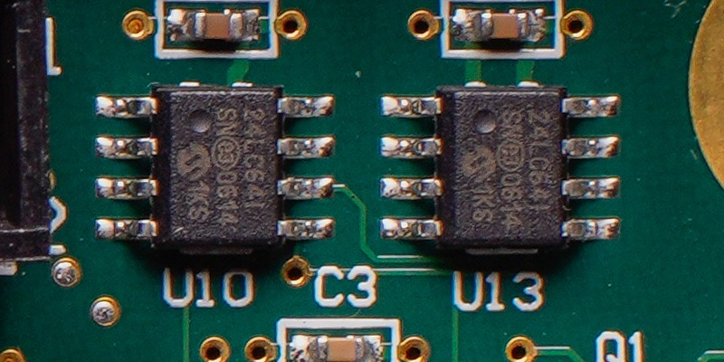

# Hardware photographs

Photographs of the inside of a real scanner, taken for this reference. They
are here to make claims about the hardware checkable: where a board number is
printed, which parts are fitted, and what a reader will actually see when they
open their own machine.

Everything on this page is **one F-135+**, serial 16402, photographed from the
component side of its main board on 24 August 2026. The base F-135 uses a
different main board, PCB #125039A, which is a separate design rather than a
revision of this one and has not been photographed at all. The reverse of this
board and the CCD, light and motor sub-boards have not been photographed
either.

Getting to this view needs the bottom plate off, which is four security
screws, with the scanner unplugged. Nothing here requires the scanner to be
powered, and there is no reason to power it with the plate off.

## The main board

PCB #125430 REV C, marked `© 2005 PAKON, INC`.

## The board number

Silkscreened along the bottom edge. This is the marking to check before
reflashing a controller, because the OEM images are tied to it: `125430A`,
`125430B` and `125430C` take hardware versions `03`, `04` and `05`
respectively, and the base F-135's `125039A` takes `02`. Putting a Plus image
on a base board is the case the OEM readme warns about in capitals. See
[per-unit data and safety](../per-unit-data-and-safety.md#recovery).

## The USB bridge

`U6`, a Cypress **CY7C68013A-128AXC**: the EZ-USB FX2LP in the 128-pin
package, date code `0801`. It sits on the right of the board, below and right
of the FPGA, with its crystal alongside. This is the bridge everything the
host does passes through, described in
[USB identity and firmware](../usb-identity-and-firmware.md).

## The two I2C EEPROMs

`U10` and `U13`, above the FPGA near the top right, both marked
`24LC64I / SN 0614 / 1KS`. A 24LC64 is 8192 bytes. These are very likely the
chips answering at `0x51` and `0x52`, though a photograph cannot say which
designator carries which address, and the strapping that decides it is not
readable here. The consequence for anyone archiving a scanner is on the
[per-unit data and safety](../per-unit-data-and-safety.md) page: if the
capacity is right, only a small part of either chip has ever been read.

The text is rotated a quarter turn. The round dot at the upper left of each
package marks pin 1.

## Also identified

Read off the same board, without a photograph good enough to reproduce here:

| Designator | Part | What it is |
|---|---|---|
| `U39` | LMD18200T | National 3A/55V H-bridge, the transport motor driver |
| `U9` | Micron `46V16M16` | DDR SDRAM |
| `U5` | IDT `71V124` | SRAM |
| `U18` | Xilinx Spartan | the FPGA the scan-window and gain registers live behind |
| `U34`, `U11` | `125506A`, `125507A` | Pakon-marked customs, function unknown |

A vertical part at the bottom right reads `UF400` beneath a doubled-V logo and
is not identified.

## Contributing

Photographs of anything listed above as not covered would be welcome,
particularly a base F-135 main board and the CCD board. The CCD's part number
is the most valuable single thing still unphotographed: its datasheet would
give the total and masked pixel counts, which bear directly on the `Offset`
question in [calibration](../calibration.md).

Photographs here are by Ali Bosworth
([alibosworth](https://github.com/alibosworth)) and carry the same CC BY 4.0
licence as the rest of the reference. Contributed photographs need to be
compatible with that.
