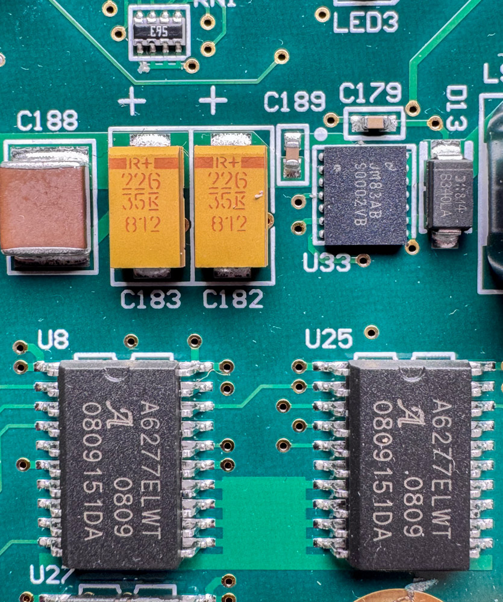
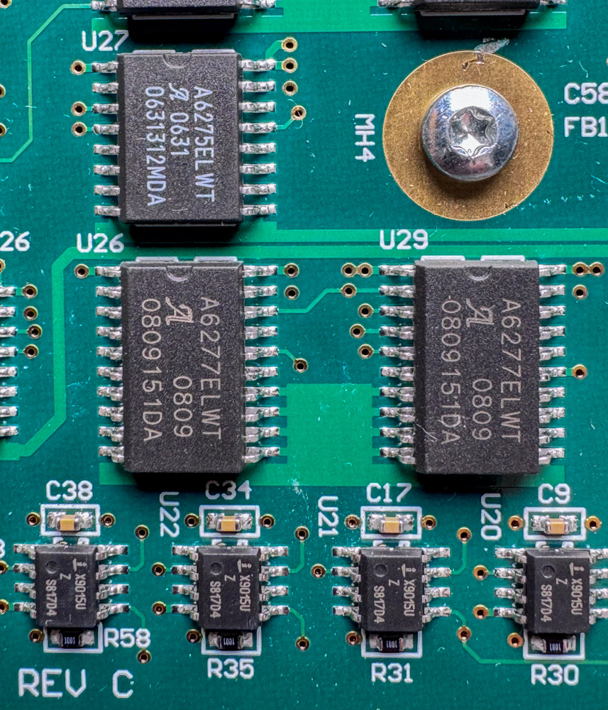
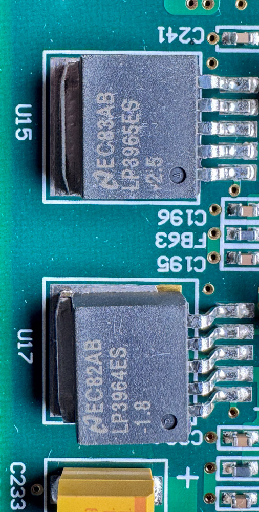

# Hardware photographs

Photographs of the inside of a real scanner, taken for this reference. They
are here to make claims about the hardware checkable: where a board number is
printed, which parts are fitted, and what a reader will actually see when they
open their own machine.

Everything on this page is **one F-135+**, serial 16402, photographed from the
component side of its main board on 24 August 2026. Getting to that view needs
the bottom plate off, which is four security screws, with the scanner
unplugged. Nothing here requires the scanner to be powered, and there is no
reason to power it with the plate off.

## What is missing

Most of the scanner. Nothing below has been photographed, and none of it can
be inferred from what has:

- **The CCD board.** The most valuable gap. Its part number would give the
  sensor's total and masked pixel counts from a datasheet, which bears
  directly on the `Offset` question in [calibration](../calibration.md).
- **The light board**, which differs between the two models: the Plus has a
  thermoelectric cooler and temperature sensing the base F-135 lacks, which is
  why their LED current ceilings differ.
- **The motor board.**
- **The reverse of the main board**, so whether the two EEPROMs below are the
  only ones in the scanner is not known.
- **Any base F-135.** Its main board is PCB #125039A, a separate design rather
  than a revision of the one here, so no part or marking on this page can be
  assumed to apply to it.
- **The DX sensor area**, where an open question about which detectors read
  the barcode is still unresolved (see [DX barcode](../dx-barcode.md)).

## The main board

PCB #125430 REV C, marked `© 2005 PAKON, INC`.

{ target=_blank rel=noopener }

## The board number

Silkscreened along the bottom edge. This is the marking to check before
reflashing a controller, because the OEM images are tied to it: `125430A`,
`125430B` and `125430C` take hardware versions `03`, `04` and `05`
respectively, and the base F-135's `125039A` takes `02`. Putting a Plus image
on a base board is the case the OEM readme warns about in capitals. See
[per-unit data and safety](../per-unit-data-and-safety.md#recovery).

{ target=_blank rel=noopener }

## The USB bridge

`U6`, a Cypress **CY7C68013A-128AXC**: the EZ-USB FX2LP in the 128-pin
package, date code `0801`. It sits on the right of the board, below and right
of the FPGA, with its crystal alongside. This is the bridge everything the
host does passes through, described in
[USB identity and firmware](../usb-identity-and-firmware.md).

{ target=_blank rel=noopener }

## The two I2C EEPROMs

`U10` and `U13`, above the FPGA near the top right, both marked
`24LC64I / SN 0614 / 1KS`. A 24LC64 is 8192 bytes. These are very likely the
chips answering at `0x51` and `0x52`, though a photograph cannot say which
designator carries which address, and the strapping that decides it is not
readable here. The consequence for anyone archiving a scanner is on the
[per-unit data and safety](../per-unit-data-and-safety.md) page: if the
capacity is right, only a small part of either chip has ever been read.

The round dot on each package marks pin 1, and the address is set by strapping
pins 1, 2 and 3. Traces from each chip run to the decoupling capacitor beside
it, `C19` for `U10` and `C25` for `U13`, and the two are wired differently,
which is what two addresses on one bus requires. Which is which has not been
worked out; it would take a continuity check rather than a photograph, and
nothing in the software depends on the answer.

{ target=_blank rel=noopener }

## Driving the light

Five Allegro serial-input constant-current LED drivers sit on the main board,
not on the light board: `A6277ELWT` at `U8`, `U25`, `U26` and `U29`, and an
`A6275ELWT` at `U27`. So the illuminant is driven from here, through the
connector, rather than by the light board's own controller.

{ target=_blank rel=noopener }

Below them are **four `X9015U` digitally controlled potentiometers** at `U20`,
`U21`, `U22` and `U23`, each with a `1001` resistor alongside. `U23` is the
leftmost and sits rotated a quarter turn from the other three, so its marking
reads horizontally where theirs read vertically. Four of them,
on a scanner with four light channels, is a coincidence worth writing down: the
OEM keeps `Current_R`, `Current_G`, `Current_B` and `Current_Ir` per resolution
base and film mode, and a constant-current driver of this family sets its
output from an external resistance. A digital pot in that position would be how
a commanded current becomes an actual one.

That is a reading of the layout, not a traced circuit. Nothing here has been
followed with a meter, the pots could as easily trim the A/D rather than the
LEDs, and the count could be coincidence. [INFERRED, and weakly: from the part
functions and the channel count only.]

{ target=_blank rel=noopener }

### The FPGA holds nothing when it is off

Spartan-IIE is SRAM-based, so `U18` has to be given its bitstream every time
the scanner powers up, exactly as the FX2 is given `Pakon7.hex`. There is no
configuration PROM beside it, and the FX2 image is far too small to contain a
150K-gate bitstream, so the configuration arrives from somewhere else. The OEM
package carries a "CCD FPGA file" alongside its controller images, which is the
obvious candidate but is not documented here yet.

The consequence for the rest of the reference: the scan-window and gain
registers described in [calibration](../calibration.md) are registers in logic
the **host itself loads**, not fixed silicon. Whatever those banks mean is a
property of the bitstream in use.

## Power

`U15` is an `LP3965ES-2.5` and `U17` an `LP3964ES-1.8`, National low-dropout
regulators supplying the 2.5 V and 1.8 V rails the FPGA and memory need.

{ target=_blank rel=noopener }

## Also identified

Read off the same board, without a photograph good enough to reproduce here:

| Designator | Part | What it is |
|---|---|---|
| `U39` | LMD18200T | National 3A/55V H-bridge, the transport motor driver |
| `U9` | Micron `46V16M16` | DDR SDRAM |
| `U5` | IDT `71V124` | SRAM |
| `U18` | Xilinx `XC2S150E`, `FTG256`, speed `7C/6I` | Spartan-IIE FPGA, 150K system gates, 256-ball BGA. The scan-window and gain register banks live behind it |
| `U34`, `U11` | `125506A`, `125507A` | Pakon-marked customs, function unknown. `U11` carries a second line that is not legible, so there may be a real part number to recover |
| `D13` | `B340LA` | Schottky rectifier |

Marks that have been read but not identified, in case someone recognises one:

| Designator | Mark | Note |
|---|---|---|
| `U14` | `LTBBW e3` | Linear Tech logo. A top-mark code rather than a part number, so decodable from LTC's marking list by anyone who has it. Nothing else is printed on the package |
| `U33` | `JM83AB` over `S0002VB` | National logo, 16-pin |
| `U16` | `CJAB 2995M` | National logo, 8-pin, beside the DDR |
| (bottom right) | `X30` over `UF400` | a vertical part, logo like two overlapping Vs |

`JM83AF` on the `U39` motor driver and `JM83AB` on `U33` share a prefix, so
that field is a National lot code rather than part of either part number.

## Contributing

Photographs of anything under [what is missing](#what-is-missing) would be
welcome, the CCD board most of all.

Photographs here are by Ali Bosworth
([alibosworth](https://github.com/alibosworth)) and carry the same CC BY 4.0
licence as the rest of the reference. Contributed photographs need to be
compatible with that.
